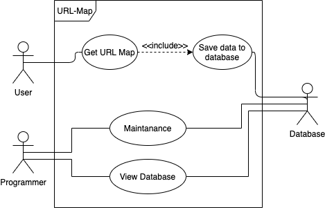
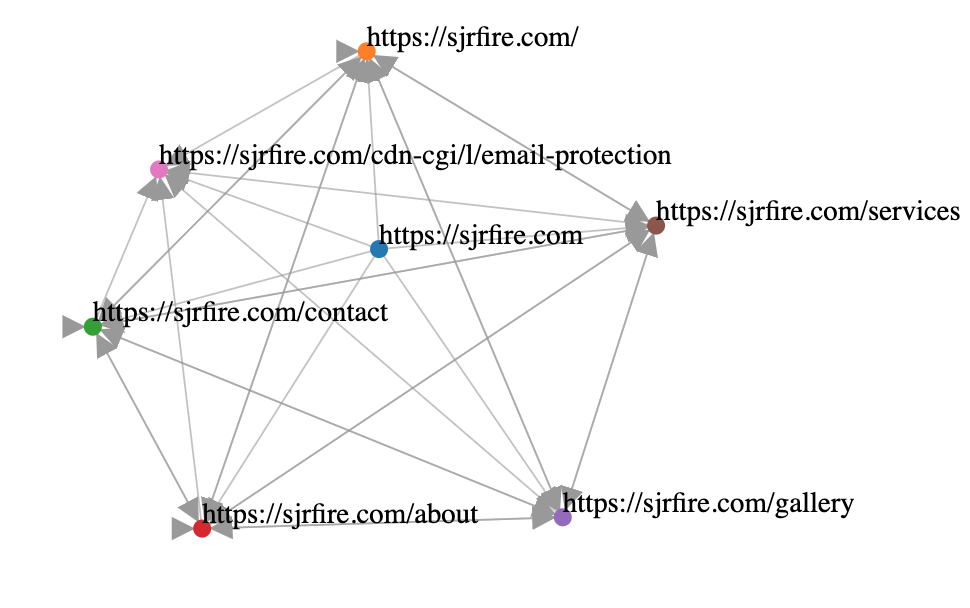

# URL-Map

## Project Abstract
_URL-Map is an open sourced project written in python. URL-Map aims to scrape web pages and display their layout in an orderly, intuitive, and interactable style. Along with this, URL-Map hopes to gather other important information from web pages and store their data for future use. URL-Map aims to help webcrawlers map their own or other's websites and help discover patterns and other valuable information._ 

## Project Relevance
_This project will cover many important goals of this class such as OOP, TDD, Multi-Threading, Parrelel Computing, GUI, and Access to Database. These values are important as they are vital skills to learn for professionals in the CS industry._

## Conceptual Design
_There are many things that could be done to improve the project including but not limited to: URL-Map display organization improvement, IP and File gathering, URL-Map interactability, Database connection, Overall speed, Cloud computing, URL-Map Domain, etc... This project is just starting so the possibilities are really limitless at this point._

## Background
_Dependencies: Python, matplotlib, networkx, bs4, selenium, requests, possibly others._ 

<https://github.com/Jack-Tilley/URL-Map>

<https://trello.com/b/TbqWKw6l/url-map>

***Building***
- Work done using python3 
- Make sure dependencies are installed 

**Running**
- Specify a webpage, hit run.
- Larger web pages may run forever. Be careful. 

## Required Resources
- _Python3_

